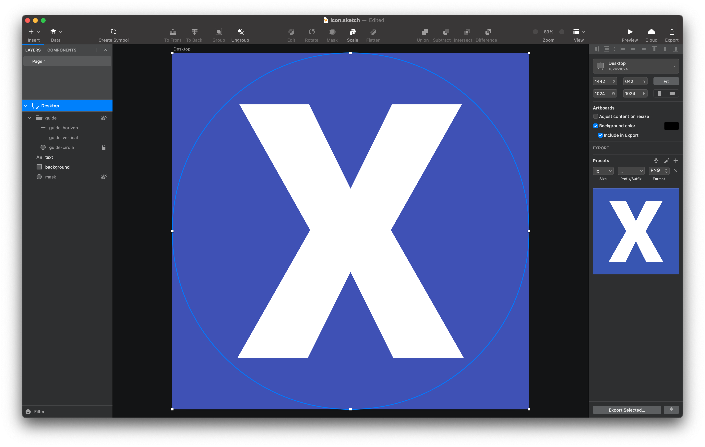
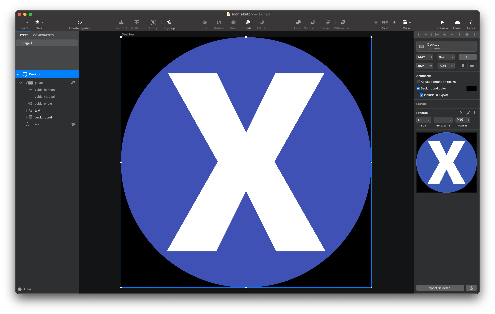

# sketch-icon-template

Icon template for Sketch

## Usage

Open `icon.sketch` by Sketch.

### Show guide temporarily

Mouse over on `guide`.

### Always show guide

Click hide icon on `guide`.

### Crop

Enable mask of `mask`.

